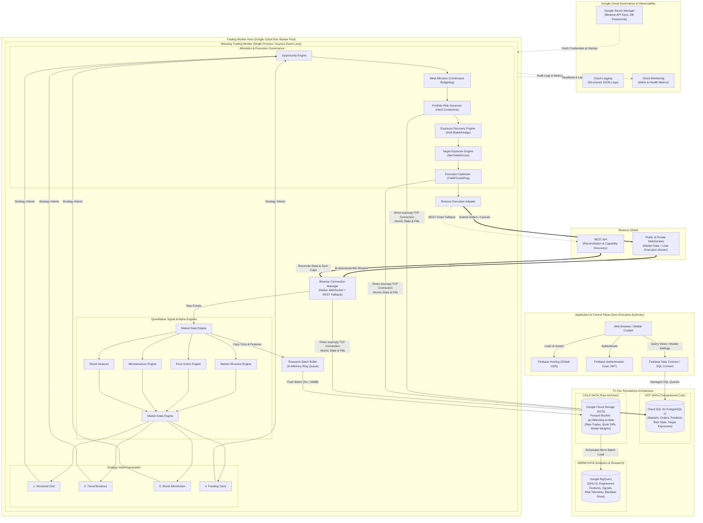

# Blessing AI v0.2 — Google SaaS-First Architecture Plan

> **Authoritative Project Architecture Specification**  
> **Target Environment**: Binance Global (Spot + USDⓈ-M Futures)  
> **Phase Scope**: Months 1–6 (MVP & Live Edge Validation)  
> **Primary Strategy**: Multi-Strategy Quantitative Platform (Structural Grid, Trend Breakout, Shock Momentum, Basis/Funding Carry)  
> **Infrastructure Model**: Google SaaS-First (Cloud SQL PostgreSQL, Firebase Auth & Hosting, Firebase Data Connect, Cloud Run Worker, BigQuery, Google Cloud Storage, Secret Manager, Cloud Logging/Monitoring)

> **v0.2 implementation note (2026-09-22):** Data Connect remains generated
> and validation-tested but is not the active UI writer. Firestore remains the
> UI authority and Cloud SQL remains the Worker operational authority until the
> v0.3 cutover criteria in `docs/ADR-2026-09-22-dataconnect-deferral-v0.3.md`
> are met. The live system must remain PAPER/disarmed unless a separately
> approved release consumes the required gates.

---

## 1. Executive Summary & Core Objective

**Blessing AI v0.2** is an adaptive, institutional-grade multi-strategy algorithmic trading platform designed for Binance Global (Spot and USDⓈ-M Futures). While historically inspired by Blessing EA, it is fundamentally **NOT a Martingale Grid system**. Grid is simply one alpha engine within an integrated ecosystem that includes:
- **Structural Mean-Reversion Grid** (Adaptive, volatility-spaced, capped depth)
- **Trend & Breakout Following** (Positive skew, pyradimid winners, asymmetric capture)
- **Shock Momentum** (Fast reaction on sub-minute horizons, liquidity sweep vs. displacement)
- **Funding & Basis Carry** (Net carry harvesting across spot and perpetual futures)

### Primary MVP Mission (Months 1–6)
The primary objective of the initial 3–6 month MVP phase is to answer a single quantitative question:
> **"Does the Blessing AI multi-strategy architecture produce a statistically significant, robust trading edge after accounting for realistic maker/taker fees, spread, slippage, funding drag, and strict capital preservation rules?"**

To answer this quickly without drowning in DevOps overhead, Blessing AI v0.2 migrates from self-managed, complex distributed infrastructure (NATS JetStream, Redis, self-hosted Prometheus/Grafana, TimescaleDB clusters) to a **Google SaaS-First architecture**.

### Core Tenets of the SaaS-First MVP
1. **Speed to Live Experimentation**: Launch the live market ingest, state machines, and paper trading pipelines within weeks.
2. **Minimal Maintenance**: Zero Kubernetes (GKE), zero self-hosted messaging brokers, zero manual database replication setup.
3. **Managed Google Cloud Stack**: Leverage Cloud Run, Cloud SQL for PostgreSQL, Firebase, BigQuery, and Google Cloud Storage.
4. **Strict Isolation of Critical Path**: The trading worker runs as an autonomous, single-process, asynchronous daemon (`asyncio` event bus). Firebase and BigQuery are strictly outside the order execution loop.
5. **Cost-Controlled Experimentation**: Operate at ~$45/month during 24/7 paper trading, and under $90/month during initial live pilot.
6. **Frictionless Migration Path**: Strategy logic, domain models, and execution interfaces are 100% cloud-agnostic Python, enabling migration to dedicated VMs (Compute Engine) or NATS if scale warrants it later.

---

## 2. Core Architectural Principles & Decision Flow

### 2.1 The Decision Hierarchy
Strategies **must never place exchange orders directly**. Every strategy produces a continuous `StrategyIntent`. The portfolio and risk layers determine actual economic exposure:

```text
Market Data (Public & Private WS / REST)
       │
       ▼
Price Action / Market Structure / Microstructure / Shock Detection
       │
       ▼
Market State Classification (Regimes R0..R6)
       │
       ▼
Strategy Engines (Grid, Trend, Shock, Carry) ──► StrategyIntents
       │
       ▼
Opportunity Engine ──► OpportunityScores
       │
       ▼
Meta Allocator (Continuous Risk Budgeting)
       │
       ▼
Portfolio Risk Governor (Hard Constraints & Survival Veto)
       │
       ▼
Exposure Recovery Engine (Grid Brake, Dynamic Hedge, Deleveraging)
       │
       ▼
Target Exposure Engine (Net Delta & Gross Exposure Optimization)
       │
       ▼
Execution Optimizer (TWAP, Pegged Limits, Maker Priority)
       │
       ▼
Binance Execution Adapter (WebSocket / REST)
```

### 2.2 Risk Philosophy: Capital Preservation Above All
- **No Uncontrolled Martingale**: Sequences such as $1\times \to 2\times \to 4\times \to 8\times \to 16\times$ are strictly forbidden.
- **Asymmetric Returns**: Profitability must be driven by Trend winners, profitable pyramiding, Shock continuation, and diversified carry, not by doubling down on adverse Grid positions.
- **Risk Governor Supremacy**: The Portfolio Risk Governor sits higher in authority than all strategies, ML models, the Meta Allocator, and the Execution Optimizer. Hard risk limits cannot be overridden by ML or heuristics.
- **Fail-Closed Default**: In case of stale market data (>3s), disconnected private user stream, unreconciled order states, or database latency breaches, the system defaults immediately to `NO_NEW_RISK` and ceases opening new exposure.

---

## 3. High-Level Architecture & Component Topology



---

## 4. Google Cloud Service Mapping & SaaS Topology

| Component Function | Google Cloud Service | Sizing / Configuration for MVP | Role in Architecture |
| :--- | :--- | :--- | :--- |
| **Frontend Web App** | **Firebase Hosting** | Free tier (Spark) / CDN | Serves the React SPA cockpit globally with microsecond latency. |
| **User Authentication** | **Firebase Auth** | Free tier (up to 50k MAUs) | Manages user login, session tokens, and admin roles. Completely isolated from Binance credentials. |
| **Application Data Layer** | **Firebase Data Connect** | SQL Connect integration | Generates type-safe relational queries and mutations directly between the Web Cockpit and Cloud SQL. |
| **Operational DB** | **Cloud SQL for PostgreSQL 17** | `db-f1-micro` (MVP Stage A/B) or `db-custom-1-3840` (Stage C) | Authoritative source of active operational state. 10GB SSD, automated daily backups, PITR enabled. |
| **Trading Worker** | **Cloud Run Worker Pool** | 1 instance, 1 vCPU, 2 GiB RAM, `--no-cpu-throttling`, `min-instances=1` | Runs the 24/7 autonomous Python trading daemon. Direct asyncpg connection to Cloud SQL. |
| **Analytics Engine** | **Google BigQuery** | On-demand (1 TB free queries/mo) | Quant research lakehouse for backtesting, regime calibration, and trade attribution. |
| **Raw Market Data Lake** | **Google Cloud Storage (GCS)** | Standard Storage (`gs://blessing-ai-data`) | Stores raw Binance tick buffers and orderbook snapshots in compressed Apache Parquet format. |
| **Secret Management** | **Google Secret Manager** | Standard tier | Securely stores Binance API keys, API secrets, and DB passwords. Accessible only via Workload Identity. |
| **Observability** | **Cloud Logging & Monitoring** | Free tier (<50 GiB/mo) | Ingests structured JSON logs; provides latency, memory, and kill-switch alert notifications. |

---

## 5. Tri-Tier Persistence Architecture: HOT / WARM / COLD

To prevent database bloat, performance degradation, and runaway cloud costs, data is strictly categorized into three distinct tiers:

```text
┌──────────────────────────────────────────────────────────────────────────────────┐
│                               DATA CLASSIFICATION                                │
├───────────────────────────┬──────────────────────────┬───────────────────────────┤
│   HOT (Cloud SQL)         │    WARM (BigQuery)       │    COLD (Cloud Storage)   │
│   Latency: < 5 ms         │    Latency: 1 - 5 sec    │    Latency: 100 - 500 ms  │
│   Purpose: LIVE TRADING   │    Purpose: ANALYTICS    │    Purpose: RAW ARCHIVE   │
├───────────────────────────┼──────────────────────────┼───────────────────────────┤
│ • Users & Exchange Metas  │ • 1m, 5m, 1h OHLCV Bars  │ • Raw WebSocket Trades    │
│ • Active Baskets & Grids  │ • Engineered PA Features │ • Full L2 Orderbook Diffs │
│ • Open Orders & Fills     │ • Microstructure Metrics │ • Funding Tick Stream     │
│ • Live Net & Gross Pos    │ • Funding & Basis History│ • Raw Mark Price Diffs    │
│ • Active Strategy Intents │ • Strategy Decisions Log │ • Tick Replay Archives    │
│ • Target Exposures        │ • Historical Risk States │ • Serialized ML Weights   │
│ • Current Risk State      │ • Backtest Results & Runs│ • Full Database Backups   │
│ • Recovery Actions        │ • Walk-Forward Trials    │                           │
│ • Heartbeat & Health      │ • Score Calibration Logs │                           │
└───────────────────────────┴──────────────────────────┴───────────────────────────┘
```

### 5.1 HOT DATA: Cloud SQL PostgreSQL
- **The Zero-Tick Rule**: Individual market data ticks (e.g. `aggTrade`, depth updates) must **NEVER** be written to PostgreSQL.
- Only transactional, state-reconciliation, and operational entities reside here:
  - `users`, `exchange_connections`
  - `strategy_configs`, `risk_configs`, `instruments`
  - `baskets`, `basket_entries`, `grid_levels`
  - `strategy_intents`, `opportunity_scores`, `allocation_decisions`
  - `target_exposures`, `orders`, `fills`, `positions`
  - `funding_events`, `portfolio_snapshots`, `exposure_recovery_actions`
  - `execution_decisions`, `model_versions`, `system_health`, `audit_events`
- All financial numbers use `NUMERIC(28, 10)` or `NUMERIC(20, 8)` to guarantee zero floating-point rounding errors.

### 5.2 WARM DATA: Google BigQuery
- Decoupled from the live execution loop. BigQuery unavailability has **zero impact** on active trading or risk enforcement.
- Tables are strictly **partitioned by date** and **clustered** to optimize query performance and limit query scan billing:
  - `market_data.ohlcv_bars`: Partitioned by `DATE(timestamp)`, clustered by `symbol, resolution`.
  - `signals.strategy_decisions`: Partitioned by `DATE(timestamp)`, clustered by `strategy_id, symbol, regime`.
  - `risk.portfolio_snapshots`: Partitioned by `DATE(timestamp)`, clustered by `risk_state`.
  - `backtests.experiment_runs`: Partitioned by `DATE(created_at)`, clustered by `strategy_id, model_version`.

### 5.3 COLD / RAW DATA: Google Cloud Storage
- Object layout:
  ```text
  gs://blessing-ai-data/
  ├── binance/
  │   ├── spot/
  │   │   └── BTCUSDT/
  │   │       └── trades/YYYY-MM-DD/hh-mm.parquet
  │   └── usdm/
  │       ├── BTCUSDT/
  │       │   ├── trades/YYYY-MM-DD/
  │       │   ├── book_depth/YYYY-MM-DD/
  │       │   ├── funding/YYYY-MM-DD/
  │       │   └── open_interest/YYYY-MM-DD/
  │       └── ETHUSDT/
  ├── research/
  ├── backtests/
  └── models/
  ```
- Market events are accumulated in an in-memory double ring-buffer inside the worker. When the buffer reaches **50 MB** or **5 minutes** elapsed, a compressed Apache Parquet file is written directly to GCS via asynchronous background worker task.

---

## 6. Trading Worker Process Architecture

In the SaaS-first MVP, the entire trading core runs inside a **single unified Cloud Run Worker container**:

```text
Blessing Trading Worker (Single Process / Asyncio Event Bus)
│
├── BinanceConnectionManager (WebSocket Ingestion, Auto-Reconnect, REST Fallback)
│
├── MarketDataEngine (In-memory Tick Cache, Resampling, Bar Generation)
│
├── PriceActionEngine (Displacement, Velocity, Swings, Liquidity Sweeps)
│
├── MarketStructureEngine (Support/Resistance, Breakout, Acceptance, Reclaim)
│
├── MicrostructureEngine (Order Book Imbalance, Flow Toxicity, Spread)
│
├── ShockDetector (Multi-horizon Normalized Z-score Volatility & Displacement)
│
├── MarketStateEngine (Regimes R0..R6 Classification & Hysteresis)
│
├── StrategyManager
│   ├── GridStrategy (Adaptive Structural Mean-Reversion)
│   ├── TrendStrategy (Breakout Following & Profitable Pyramiding)
│   ├── ShockStrategy (Momentum Continuation vs. Fast Reversal)
│   └── CarryStrategy (Basis & Funding Arbitrage)
│
├── OpportunityEngine (Calibration & Normalization of Signals)
│
├── MetaAllocator (Continuous Multi-Factor Risk Budgeting)
│
├── PortfolioEngine (Net Delta, Gross Exposure, Correlation Aggregator)
│
├── PortfolioRiskGovernor (Hard Survival Limits, Drawdown Guard, Kill Switch)
│
├── ExposureRecoveryEngine (Grid Brake, Dynamic Hedge, Toxic Inventory Trimming)
│
├── TargetExposureEngine (Net Target Calculation, Portfolio Offsetting)
│
├── ExecutionOptimizer (Maker-First Limit Pegging, TWAP, Slippage Defense)
│
├── BinanceExecutionAdapter (Native WS/REST Order Submission)
│
└── PersistenceLayer (Cloud SQL asyncpg writer + GCS Parquet Buffer)
```

### Module Boundaries & In-Process Event Bus
- Communication between engines occurs via Python `asyncio.Queue` passing immutable Pydantic `DomainEvent` instances.
- Engines have zero direct dependencies on external messaging protocols or Binance-specific data models.
- If scaling demands distributed workers in the future, the in-process `asyncio.Queue` can be replaced with Google Cloud Pub/Sub or NATS JetStream by swapping the event bus adapter, without touching a single line of quantitative strategy or risk code.

---

## 7. Operational Safety, Fail-Closed Rules & Reconciliation

### 7.1 Separation of Concerns
1. **Critical Path**: `Market Data -> Signals -> Strategies -> Allocator -> Risk Governor -> Execution -> Binance`.
2. **Sidecar Persistence**: Database commits and research buffer flushes occur concurrently without blocking the next tick evaluation.
3. **Control Plane Independence**: Firebase Auth, Firebase Hosting, and Data Connect provide visualization and administrative parameter tuning. If Firebase suffers an outage, the Trading Worker continues executing trailing stops and dynamic hedges autonomously.

### 7.2 Fail-Closed Invariants
- **Data Stale Watchdog**: If no valid mark price or book ticker update is received for >3,000 ms on an active instrument, that instrument transitions to `NO_NEW_RISK`.
- **Private Stream Disconnect**: If the Binance user execution stream drops, the worker immediately rejects all new order generation until the stream is reconnected and reconciled against the REST API.
- **Startup & Reconnect Reconciliation**:
  ```text
  Disconnect Detected
         │
         ▼
  Halt New Order Placement (NO_NEW_RISK)
         │
         ▼
  Re-establish WebSocket Connection (Exponential Backoff: 1s, 2s, 4s, 8s, max 30s)
         │
         ▼
  Query REST: GET /api/v3/openOrders & GET /fapi/v2/positionRisk
         │
         ▼
  Reconcile Active Baskets vs Exchange Fills
         │
         ▼
  Audit Target Exposure vs Current Physical Exposure
         │
         ▼
  Resume Normal Evaluation Loop
  ```
- **Idempotent Order Management**: Every order is submitted with a deterministic `clientOrderId` (e.g. `BLS_BTC_GRD_L3_1726040000`). Retries or reconnects query the exchange by `clientOrderId` to prevent duplicate order submissions.

---

## 8. Strategy Engine Specifications (Preserved & Enhanced)

### 8.1 Structural Adaptive Grid Engine
- **Not Fixed Pips**: Grid level spacing is dynamic: $S_i = \max(ATR_{14} \times M_i, \text{VolFactor} \times \sigma_{\text{rolling}}, \text{MinTickSpan})$.
- **Grid Depth Cap**: Maximum 5 active grid levels during the MVP.
- **Grid Brake**: When Shock Detector fires or regime switches to R3 (Strong Trend) / R5 (Volatility Shock), the Grid Brake immediately halts new limit order placement.
- **Deleveraging**: If grid drawdown approaches threshold $D_{\text{thresh}}$, the Exposure Recovery Engine begins trimming the earliest, most toxic entry inventory rather than adding more levels.

### 8.2 Trend & Breakout Engine
- Independent alpha engine providing **positive return skew**.
- Identifies structural breakouts confirmed by volume displacement and price velocity.
- **Profitable Pyramiding**: Adds to winning positions only when the initial position is in profit ($>1.5 \times ATR$), risk budget permits, and market structure remains valid. Never pyramids losing positions.

### 8.3 Shock Momentum Engine
- Reacts on sub-minute horizons (5s, 15s, 1m).
- Uses rolling normalized Z-scores of price displacement: $Z = \frac{\Delta P - \mu_{\Delta P}}{\sigma_{\Delta P}}$.
- Differentiates between true range expansion (displacement) and false liquidity sweeps.
- Enforces mandatory state transition: a Shock trade must either hit its quick take-profit or explicitly transition via `SHOCK -> TREND`.

### 8.4 Basis & Funding Carry Engine
- Tracks annualized basis: $\text{Basis}_{\text{ann}} = \frac{F - S}{S} \times \frac{365}{D_{\text{expiry}}}$.
- Evaluates net yield after deducting taker fees, round-trip slippage, and capital financing cost.
- Carry signals apply a discount/bonus to the Meta Allocator risk budget rather than taking naked unhedged positions.

---

## 9. Revised Phase 0–7 Development Roadmap

```text
Phase 0: Google Cloud Foundation (Cloud SQL, Firebase, GSM, GCS, BigQuery)
   │
Phase 1: Binance Ingest & Market Lakehouse (WS Streams, Parquet Buffer)
   │
Phase 2: Deterministic Strategy Engines & Backtester (Grid, Trend, Shock, Allocator)
   │
Phase 3: Exposure Recovery & Dynamic Hedging (Grid Brake, Profit Harvesting)
   │
Phase 4: Futures Intelligence & Basis Carry (Funding, Basis, OI Tracking)
   │
Phase 5: 24/7 Paper Trading on Cloud Run (Reconciliation, Fail-Closed Audit)
   │
Phase 6: Machine Learning Calibration (CatBoost/LightGBM Safety Scores)
   │
Phase 7: Small Live Pilot (Strict Risk Caps, BTC/ETH Live Execution)
```

- **Phase 0 — Google Cloud Foundation**: Provision GCP project, Cloud SQL PostgreSQL 17 instance, Firebase Auth & Data Connect, Secret Manager secrets, GCS bucket (`gs://blessing-ai-data`), BigQuery datasets, and Cloud Logging sinks. No exchange connectivity yet.
- **Phase 1 — Binance Connectivity & Market Ingest**: Implement Binance Connection Manager (WebSocket-first, REST snapshot), symbol capability discovery (tick size, min notional, leverage limits), GCS Parquet buffer, and zero-loss reconnect tests.
- **Phase 2 — Deterministic Alpha Engines**: Implement Price Action Engine, Market Structure, Shock Detector, Market State Classifier, Grid, Trend, Shock strategies, Meta Allocator, and Risk Governor. Validate through realistic event-driven backtesting.
- **Phase 3 — Exposure Recovery**: Implement Grid Brake, dynamic counter-exposure sizing, hedge profit harvesting, toxic inventory reduction, and progressive de-risking state machines.
- **Phase 4 — Futures Intelligence**: Integrate USDⓈ-M funding, basis, and open interest metrics; implement the Basis Carry Strategy; integrate funding drag penalties into the Meta Allocator.
- **Phase 5 — 24/7 Cloud Run Paper Trading**: Deploy the unified worker to Cloud Run with `min-instances=1` and `--no-cpu-throttling`. Run 24/7 paper trading on BTCUSDT and ETHUSDT. Verify crash recovery, reconciliation, and Cloud SQL performance.
- **Phase 6 — Machine Learning Calibration**: Train tabular safety models (CatBoost/LightGBM) on BigQuery feature tables. Deploy model weights to GCS. Integrate predictions as opportunity score modulators.
- **Phase 7 — Small Live Pilot**: Transition from Paper to Live on Binance Spot and USDⓈ-M Futures with strict capital limits (max $1,000 equity, max $2\times$ leverage), IP whitelisting, and withdrawals disabled.

---

## 10. Repository & Directory Layout

```text
blessing-ai/
├── apps/
│   ├── web/                    # React 18 + Vite Web Cockpit
│   ├── trading_worker/         # Cloud Run single-process trading daemon (main.py)
│   └── api/                    # Optional lightweight FastAPI gateway (if needed)
├── domain/                     # Pure domain models, enums, immutable events (Pydantic)
│   ├── enums.py
│   ├── events.py
│   ├── models.py
│   └── interfaces.py
├── core/                       # Core quant algorithms (Cloud-agnostic)
│   ├── price_action/           # Displacement, Swings, Sweeps, Velocity
│   ├── market_structure/       # Support/Resistance, Breakout, Acceptance
│   ├── microstructure/         # Orderbook Imbalance, Spread, Flow Toxicity
│   ├── shock/                  # Multi-horizon Z-score Shock Detection
│   ├── market_state/           # Regime Classifier R0..R6
│   ├── strategies/             # Grid, Trend, Shock, Carry engines
│   ├── allocator/              # Opportunity Engine & Meta Allocator
│   ├── risk/                   # Portfolio Risk Governor & Hard Constraints
│   ├── recovery/               # Exposure Recovery Engine & Grid Brake
│   └── execution/              # Target Exposure & Execution Optimizer
├── venues/                     # Exchange adapters
│   └── binance_global/         # Native WebSocket, REST, Capability Discovery
├── persistence/                # Tri-tier persistence implementations
│   ├── postgres/               # asyncpg Cloud SQL queries & migrations
│   ├── bigquery/               # Schema definitions & batch loaders
│   └── cloud_storage/          # Parquet ring-buffer & GCS client
├── firebase/                   # Firebase configuration
│   ├── dataconnect/            # SQL Connect schemas & GraphQL connector
│   └── hosting/                # Static build target
├── cloud/                      # Deployment descriptors
│   ├── run/                    # Dockerfile & Cloud Run deployment scripts
│   ├── sql/                    # Migration scripts & DDL
│   ├── bigquery/               # BigQuery DDL & partitioning scripts
│   └── secrets/                # Secret Manager setup scripts
├── research/                   # Jupyter notebooks, feature engineering, analysis
├── backtest/                   # Realistic event-driven backtesting engine
├── config/                     # Pydantic configuration schemas & settings
├── docs/                       # Architectural documentation & Cost Models
│   └── COST_MODEL.md
└── tests/                      # Unit, integration, and property-based tests
```
